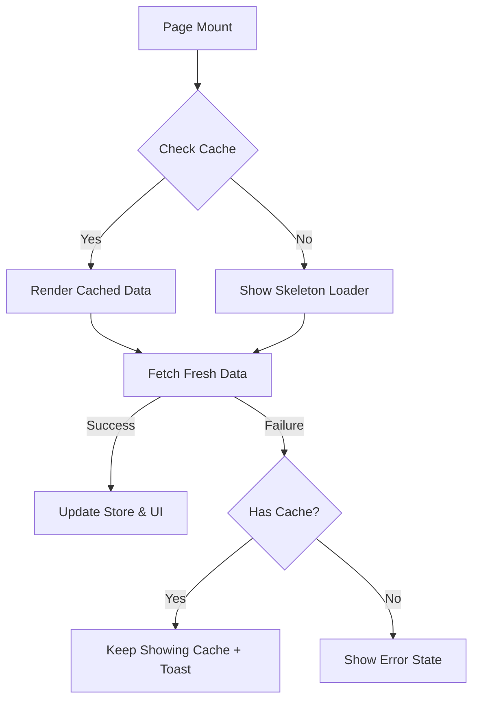

# System Patterns

## 1. Core Philosophies

- **Resilience First**: Assume the network is flaky. Handle 404s (broken images) and offline states gracefully.
- **Perceived Performance**: Show content immediately. Use Skeleton Loaders instead of spinners. Use Stale-While-Revalidate caching.
- **Atomic Design**: Build small, reusable components (Atoms) and compose them into complex UIs (Organisms).

## 2. Tech Strategy & Decisions

- **Framework**: Nuxt 4 (Hybrid Rendering). SSR for the app shell, `<ClientOnly>` for heavy interactive parts (Cart, Modals).
- **State Management**: Pinia. Centralized stores (`cart`, `catalog`) handling logic and persistence (`localStorage`).
- **Styling**: Tailwind CSS. Utility-first for consistency and small bundle size.
- **Testing**: Vitest for Unit Tests (Business Logic), Playwright for E2E (Critical Flows).

## 3. Code Patterns (Do's)

- **Data Fetching**:
  1. Check Store/Cache.
  2. Render immediately if available.
  3. Fetch fresh data in background.
  4. Handle errors silently if cache exists.
- **Defensive Coding**:
  - Always use optional chaining (`item?.image_url`).
  - Provide fallback UI (Universal Placeholders) for missing assets.
- **Component Structure**:
  - **Props**: Pass data down.
  - **Events**: Emit actions up.
  - **Stores**: Handle business logic and API calls.

## 4. Anti-Patterns (Don'ts)

- **Raw API Calls in Components**: Always go through the Store -> API Client.
- **Logic in Templates**: Move complex conditionals to Computed properties.
- **Prop Drilling**: Use Pinia for state needed by deeply nested or sibling components (e.g., Cart count).

## 5. Key Flows (Mermaid)

### Catalogue Loading Strategy

